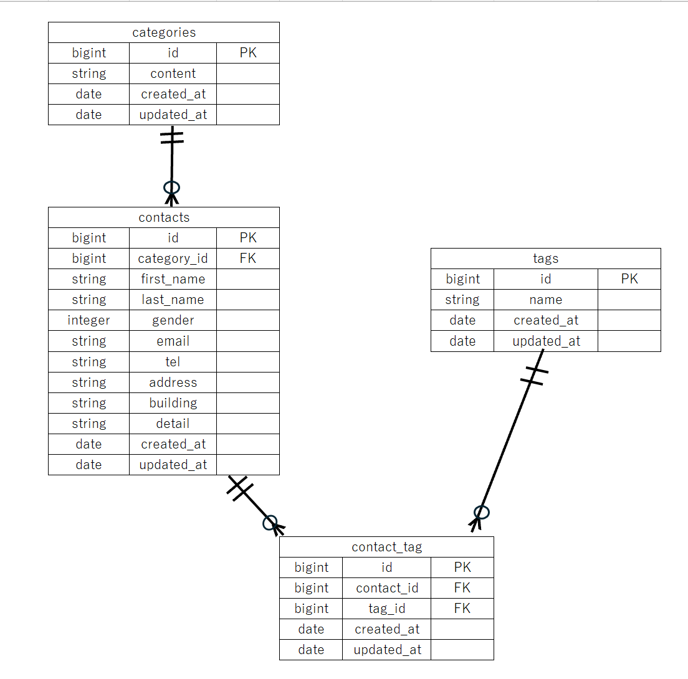

# contact-form-app

## プロジェクト名
COACHTECH　お問い合わせフォーム

## 概要
本システムは、一般ユーザが利用でする公開のお問い合わせフォームです。
誰でもお問い合わせを送信でき、管理者はログイン後に問い合わせ内容を確認、管理します。

## ER図

## 環境構築手順
本プロジェクトを実装するにあたり、下記手順に沿って環境構築を行います。
なお下記コマンドなどはWindowsに合わせております。

0. 必要なツール
環境構築を始める前に事前準備として下記のツールをインストールしておく必要があります。
- Docker Desktop
- Git
- テキストエディタ(VS CODE)

1. Laravelプロジェクトの作成（Laravel 10.x） 
以下のDockerコマンドをWSL上で実行し、Laravel 10.xを明示的に指定してプロジェクトを作成します。実行後はcontact-form-appディレクトリが作成されています。
    docker run --rm \
    -u "$(id -u):$(id -g)" \
    -v "$(pwd):/var/www/html" \
    -w /var/www/html \
    -e COMPOSER_CACHE_DIR=/tmp/composer_cache \
    laravelsail/php82-composer:latest \
    composer create-project laravel/laravel:^10.0 contact-form-app

2. Laravel Sailのインストール
プロジェクト作成後、作成されたcontact-form-app ディレクトリに移動し、Laravel Sailをインストールします。

1) プロジェクトディレクトリに移動します
cd contact-form-app

2) Laravel Sailをインストールします
docker run --rm \
    -u "$(id -u):$(id -g)" \
    -v "$(pwd):/var/www/html" \
    -w /var/www/html \
    -e COMPOSER_CACHE_DIR=/tmp/composer_cache \
    laravelsail/php82-composer:latest \
    composer require laravel/sail --dev

3) Sailの設定ファイルをパブリッシュします（MySQLを利用できるように選択します）
docker run --rm \
    -u "$(id -u):$(id -g)" \
    -v "$(pwd):/var/www/html" \
    -w /var/www/html \
    -e COMPOSER_CACHE_DIR=/tmp/composer_cache \
    laravelsail/php82-composer:latest \
    php artisan sail:install --with=mysql

3. .env ファイルの設定
プロジェクト内にある.envファイルをテキストエディタで開き、
データベース接続情報が以下と一致していることを確認します。

DB_CONNECTION=mysql
DB_HOST=mysql
DB_PORT=3306
DB_DATABASE=laravel
DB_USERNAME=sail
DB_PASSWORD=password

重要: DB_HOST は localhost や 127.0.0.1 ではなく、Dockerコンテナ名である mysql を指定します。

4. フロントエンドのセットアップ (Vite & Tailwind CSS)
本プロジェクトでは、フロントエンドのスタイリングにTailwind CSSを使用しますので
併せてインストールしておきます

0) sailを起動させます
./vendor/bin/sail up -d

1) NPM依存パッケージのインストールします
sail npm install

2) Tailwind CSSのインストールします
sail npm install -D tailwindcss@^3.4.0 postcss autoprefixer
sail npm install alpinejs

3) 設定ファイルの生成します
sail npx tailwindcss init -p

4) Tailwind CSSのtailwind.config.js を開き、
以下のようにテンプレートパス設定します。
/** @type {import("tailwindcss").Config} */
export default {
  content: [
    "./resources/**/*.blade.php",
    "./resources/**/*.js",
    "./resources/**/*.vue",
  ],
  theme: {
    extend: {},
  },
  plugins: [],
}

5) 本プロジェクトで使用するBladeテンプレートを獲得するため、resourcesフォルダをcoachtechが提供するresourcesフォルダに丸ごと入れ替えます。

入れ替え手順:
① WSLでexplorer.exeと入力しエクスプローラーを開きます。
② プロジェクト内の resources フォルダを削除します。
③ WSL上で下記コマンドを実行します。
git clone https://github.com/coachtech-prepared-file/Preparedblade-ConfirmationTest-ContactForm.git
④ エクスプローラの同じフォルダ内にPreparedblade-ConfirmationTest-ContactFormという名前のフォルダがインストールされていることを確認します。
⑤そのフォルダ内のresourcesフォルダのみをコピーして一つ上の階層（プロジェクト直下）へ配置します
⑥入れかえたresourcesフォルダ内にデフォルトでは格納されていないauthなどのフォルダが格納されていることが確認できれば正しく入れ替えが完了しています。
※なおresources内にZone.Identifierデータが格納されていることがありますが、
そちらはWindows がインターネットからダウンロードしたファイルに自動で付ける「安全情報メタデータ」であり、Laravelとは何も関係ないため、削除して問題ありません。

6) Vite開発サーバーの起動します。
sail npm run dev
注意: sail npm run dev は実行したままにしておく必要があります。

5. phpMyAdminの追加
phpMyAdminを利用するため
compose.yaml を開き、mysql サービスの後に以下の設定を追加してください。
冒頭はほかの記載されている行に合わせます。

compose.yaml に追加する内容:

    phpmyadmin:
        image: 'phpmyadmin:latest'
        ports:
            - '${FORWARD_PHPMYADMIN_PORT:-8080}:80'
        environment:
            PMA_HOST: mysql
            PMA_USER: '${DB_USERNAME}'
            PMA_PASSWORD: '${DB_PASSWORD}'
        networks:
            - sail
        depends_on:
            - mysql
    
6. sailの起動とエイリアスの設定
1) Sailをバックグラウンドで起動します
./vendor/bin/sail up -d

2) エイリアスを設定して 'sail' だけでコマンドを実行できるようにします
echo "alias sail='[ -f sail ] && bash sail || bash vendor/bin/sail'" >> ~/.bashrc

3) 設定の確認のためシェルを再起動するか、新しいターミナルを開いてエイリアスを有効にします
exec $SHELL

7. アプリケーションキーの生成
ルートで以下のコマンドを実行することでアプリケーションキーを生成します。
sail artisan key:generate

8. データベースのマイグレーションと初期データ投入
以下のコマンドでテーブルを作成し、初期データを投入します。
sail artisan migrate --seed

※既存のデータベースをリセットしたい場合は以下を実行してください。
sail artisan migrate:fresh --seed

## 使用技術
- PHP 8.x
- Laravel 10.x
- MySQL、phpMyAdmin
- マイグレーション、シーダー
- Docker
- Nginix

## APIエンドポイント一覧
- GET /api/v1/contacts -お問い合わせ一覧（検索・ページネーション付き）
- GET /api/v1/contacts/{contact} -お問い合わせ詳細（カテゴリ・タグを含む）
- POST /api/v1/contacts/ -お問い合わせ新規作成
- PUT /api/v1/contacts/{contact} -お問い合わせ更新
- DELETE /api/v1/contacts/{contact} -お問い合わせ削除

## 開発環境URL

## 作成者
出村　絵美奈(旧姓は池堂)
